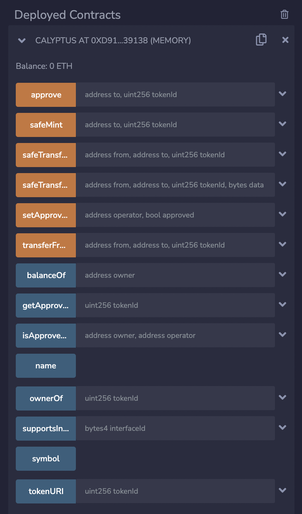

# Introduction to IPFS & Pinata

## Introduction to IPFS & Pinata

In the ERC-721 lesson in the Token Standards module, we learnt how to write a smart contract for creating NFTs as shown below:

```solidity
// SPDX-License-Identifier: MIT
pragma solidity 0.8.7;


import "@openzeppelin/contracts/token/ERC721/ERC721.sol";


contract Calyptus is ERC721 {
   constructor() ERC721("Calyptus", "CAL") {}


   function safeMint(address to, uint256 tokenId) public {
       _safeMint(to, tokenId);
   }
}
```



This is a very basic contract and just creates a mapping of (uint => address) which puts a token ID against a wallet address that executed the safeMint function. 

Thus, with this contract, an address can own a token ID (which is technically an NFT). But this token ID is nothing until it points towards something, like an image, media piece, music, legal documents, gaming object etc. 

If these digital objects are tied to our NFT (the token ID that we minted), the user can get some utility out of it, for example, access to a website/portal, legal rights, levelling-up in a game or simply bragging rights for owning a piece of art etc.

In this lesson we will take a collection of images and connect it to an ERC-721 contract to create an NFT collection, just like the BAYC, Cryptopunks etc.

We’ll write an ERC-721 contract and connect each token ID to an image through its metadata (the metadata contains the details about the image and its properties).

But where will we store these images? We won’t do it on blockchain since storing data on blockchain costs a lot, especially if we try to store images on it.

We also won’t store it on a centralised server since it compromises the values of decentralisation.

We would rather store it on something called the IPFS (InterPlanetary File System) which is a distributed peer-to-peer system for storing and accessing files and data, just like BitTorrent.

When we upload a file to IPFS, it doesn’t get stored at a single location but it gets distributed throughout the network.

In a regular centralised server based system, files are accessed via location based access, i.e. through its URL. If the server goes down, you can’t access the file.

But in IPFS, a file is accessed via content based access, i.e. a file is accessed through its unique hash and it can be downloaded from any node in the system that stores it.

Thus, IPFS doesn’t have a single point of failure because the files are distributed across the network.

But IPFS is not a blockchain. There’s a possibility that all the nodes storing a particular file may delete that particular file individually. In that case, we might not be able to retrieve our required file.

The solution to this problem is pinning the file. Pinning is the process where you can either pay a particular node to permanently store a file on the network or you can use services like Pinata that does the pinning for you as well as provides an interface to upload and access the files on IPFS.

You can simply create an account on Pinata, and use it to upload and access files on IPFS. To create an account, go to the following link :

[https://www.pinata.cloud/]

You can select the Builder/Developer option at the bottom although it doesn’t impact the user experience.

Here you can upload the images and metadata for your NFT that can then be connected to your ERC-721 smart contract (we’ll do this in the next lesson). With this, we’ll now have two mappings on the blockchain :

- Token ID –> User Address
- Token ID –> Token URI (This mapping is actually done through a function that returns a URI for each token ID as we’ll see later in this lesson)

i.e. one mapping will contain which user address owns a particular token ID. The second mapping maps the token URI to each token ID. The token URI is the hash of metadata stored on IPFS that contains the details and properties of the image associated with the token ID.

Thus, we establish the ownership of NFTs on the blockchain by storing the token IDs, wallet addresses and token URI function. Whereas the images and their details & properties are stored on the IPFS and connected to the smart contract via token URI.