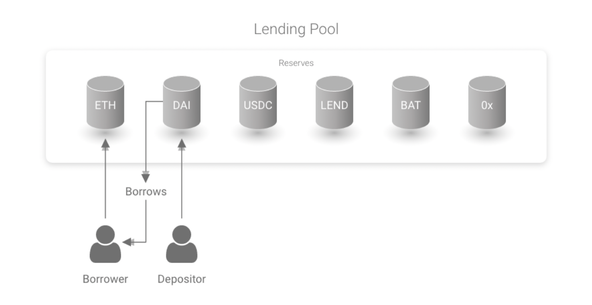

# Introduction to Aave

## Introduction

Aave is an open-source, non-custodial, and decentralised lending and borrowing platform built on the Ethereum blockchain. The protocol allows users to lend and borrow a wide range of digital assets, including cryptocurrencies and tokens, in a trustless and transparent manner.

People who borrow money have to pay interest, and people who lend it receive interest, similar to a bank. However, instead of a bank or loan manager making decisions, it is executed with smart contracts, which are sets of code that automatically execute transactions when certain conditions are met, replacing the middlemen (banks).

One of the key features of Aave is the requirement for borrowers to deposit collateral in order to borrow another asset. For example, a borrower may need to deposit 10 ETH in order to borrow 8 ETH worth of DAI. This is known as being overcollateralized, and the ratio of borrowed asset to deposited asset is called the Loan to Value (LTV) ratio, which is 80% in the above case.

This requirement may seem counterintuitive, as one might wonder why someone would take out a loan if they have to deposit more value in collateral. However, the ability to borrow assets without having to exit a long position on a specific asset can be beneficial for those who believe that the value of the deposited asset will increase in the future. This allows them to use the borrowed asset while still holding onto their deposited asset, since they can get it back by repaying the borrowed asset later.

Aave was created by a team of coders led by Stani Kulechov. It launched in November 2017 as ETHLend and rebranded in September 2018 to its current name (which means “ghost” in Finnish).

ETHLend was originally a P2P lending and borrowing platform where lenders were matched with borrowers. It was then revamped into a more efficient lending and borrowing model and rebranded as Aave.

The way Aave works is that people deposit their money into a “liquidity pool.” From there, the protocol can use that money to give loans to other people. This large pool of cryptocurrency allows the code to loan funds on a large scale and as needed. With smart contracts, transactions are automated and happen nearly immediately. The loan can be paid back at any time by the borrower, along with the associated interest, which varies based on the type of asset that was borrowed.

Aave has become one of the biggest lending protocols for cryptocurrencies, along with competitors Compound and MakerDAO. The market leader changes often, but during the time of writing this lesson, Aave holds over $6 billion in value across all chains.

## Lending assets on Aave
Aave supports a variety of digital assets, including but not limited to stablecoins like tether (USDT), USDC or DAI, and tokens such as BAT, MANA among others. The annual rate of return fluctuates based on the asset, blockchain, level of supply and demand, and which Aave version you are using. Currently, there are three iterations of the protocol: Aave version 1, v2, or v3 – each of which brought upgrades to the network.

According to analytics platform DeFi Llama, Aave v2 remains the largest public lending market, with $5.29 billion in TVL. Aave v3, by comparison, has $1.47B in TVL. Aave’s largest market is Aave Arc, a permissioned DeFi lending protocol used by financial institutions, such as Binance and Coinbase.

V3, which launched in March 2022, reduces transaction costs and enables the community to vote on already approved stablecoins for borrowing or collateral. Interestingly, the latest version of the protocol only supported Ethereum layer 2 networks such as Arbitrum and Optimism and other popular blockchains such as Polygon and Fantom at its launch. It didn’t support Ethereum’s base layer. The second iteration (v2) supports Ethereum natively, plus Polygon and Avalanche.

Contribute your assets to Aave by visiting the market and selecting which blockchain and version of Aave you’d like to use.

### To lend (supply) crypto on Aave, you will need to follow these steps:

- From your MetaMask account, buy some cryptocurrency (e.g. ETH) that you want to lend on the Aave platform.
- Connect your digital wallet to the Aave platform by visiting the Aave website and clicking on the “Connect Wallet” button. Follow the prompts to grant the Aave platform access to your wallet.
- Once your wallet is connected, you can select the cryptocurrency that you want to lend from the list of available assets. You will see the current interest rate (APY) and other details about the asset, such as the minimum and maximum amount that you can lend.
- Click the Supply button and enter the amount of cryptocurrency that you want to lend to initiate the transaction (Your wallet shouldn’t be empty for the Supply button to be activated). The funds will be transferred from your wallet to the Aave platform and will be available for borrowers to use.
- You will start earning interest on your lent funds as soon as they are borrowed by another user. The interest rate may fluctuate over time based on market conditions and the demand for the particular asset. You can view your current earnings and other details about your lent assets by visiting the “My Deposits” section of the Aave platform.

Returns vary by asset; as of this writing, supplying ETH on Aave v2 provides an annual return of 1.57%.

## Borrowing assets
Borrowing assets is essentially the same process, just reversed. You will need to put up collateral in the form of assets before you are able to borrow anything. The borrowed amount will be as per the Loan to Value (LTV) w.r.t. to the deposited asset.

There’s no specific time limit to return the borrowed asset. You can return it anytime along with the interest. Just that the value of deposited asset shouldn’t drop below a particular threshold w.r.t. The borrowed asset which might lead to the liquidation of your collateral. We’ll discuss this in more detail in the Liquidation section ahead in this lesson.

### To borrow crypto on Aave, you will need to follow these steps:

- Connect your Metamask wallet to the Aave platform by visiting the Aave website and clicking on the “Connect Wallet” button. Follow the prompts to grant the Aave platform access to your wallet.
- Select the cryptocurrency that you want to borrow from the list of available assets e.g. ETH. You will see the current interest rate and other details about the asset, such as the minimum and maximum amount that you can borrow.
- Click the Borrow button and enter the amount of ETH that you want to borrow to initiate the transaction (Your wallet shouldn’t be empty for the Borrow button to be activated, and to see the available amount of each asset). You will be required to provide collateral in the form of another cryptocurrency in order to secure the loan. The amount of collateral required will depend on the risk assessment of the loan, as well as the value of the asset that you are borrowing.
- Once the loan is approved, the borrowed funds will be transferred to your wallet and you can use them as you see fit.
- You will be required to pay back the borrowed funds plus interest at a later date. The interest rate may fluctuate over time based on market conditions and the demand for the particular asset. You can view your current borrowing details and make payments by visiting the “My Borrows” section of the Aave platform.

## Liquidation
As we said above, on the Aave protocol, users can borrow and lend various cryptocurrencies using a collateralized debt position (CDP). When a user borrows from the protocol, they must provide collateral in the form of a cryptocurrency to secure the loan. The value of the collateral deposited must be greater than the value of the loan, and the collateral is held in the CDP until the loan is repaid. This is called: **overcollateralization**.

The value of the collateral shouldn’t fall below a certain level w.r.t. the borrowed asset, say 105% of the value of the borrowed asset. This threshold is called the liquidation threshold. The ratio of collateral value to the liquidation threshold is called the health factor. Thus, when the value of collateral falls to the level that’s below the liquidation threshold, the health factor becomes < 1. This leads to the liquidation of the collateral to repay the borrowed asset. 

Up to 50% of the borrowed asset is liquidated when health factor becomes < 1. Anyone (including you) can liquidate the asset. The liquidator needs to deposit the borrowed asset and receive the equivalent amount of collateral asset plus a bonus (say 5%) as a liquidation fee. Practically, liquidators usually install bots to beat the competition.

### Here are 2 examples from Aave’s documentation:

### Example 1 

- Bob deposits 10 ETH and borrows 5 ETH worth of DAI (LTV 50%)
- If Bob’s Health Factor drops below 1, his loan will be eligible for liquidation
- A liquidator can repay up to 50% of a single borrowed amount = 2.5 ETH worth of DAI
- In return, the liquidator can claim a single collateral which is ETH (5% bonus) 
- The liquidator claims 2.5 + 0.125 ETH for repaying 2.5 ETH worth of DAI.

### Example 2 

- Bob deposits 5 ETH and 4 ETH worth of YFI, and borrows 5 ETH worth of DAI 
- If Bob’s Health Factor drops below 1 his loan will be eligible for liquidation
- A liquidator can repay up to 50% of a single borrowed amount = 2.5 ETH worth of DAI
- In return, the liquidator can claim a single collateral, as the liquidation bonus is higher for YFI (15%) than ETH (5%) the liquidator chooses to claim YFI
- The liquidator claims 2.5 + 0.375 ETH worth of YFI for repaying 2.5 ETH worth of DAI.

### How can you avoid getting liquidated?

To avoid liquidation, you can increase your health factor by depositing more collateral assets or repaying part of your loan. Repayments generally have a greater impact on your health factor than deposits, although it is important to monitor your health factor and try to keep it as high as possible to avoid liquidation. 

For example, keeping your health factor above 2 can provide a buffer to help you avoid liquidation. It is important to regularly check and manage your health factor to ensure it remains high.

### Flash Loans

A flash loan is a way to take millions of dollars of loan from platforms like Aave without any collateral. There’s a catch though. The loan needs to be returned within the same blockchain transaction. But why would anyone take a flash loan then?

For ‘Arbitrage’ opportunities, mostly.

Let’s understand how a blockchain transaction works. A blockchain transaction consists of multiple steps. And all those steps need to be completed for the transaction to be valid. Even if one step fails, the entire transaction is reverted.

Eg: If A sends B 50 ETH, 

Step 1 -> A’s ETH balance needs to be reduced by 50 ETH, 

Step 2 -> B’s ETH balance needs to be added with 50 ETH. 

If the first step gets completed and the second step fails because of some reason, the first step is also reverted. Hence, the entire transaction fails and nothing gets changed.

Now let’s understand what’s arbitrage. If ETH is being sold at 100$ on one exchange and 101$ at another exchange, you can buy thousands of ETH from the first exchange and sell it on the second exchange. Thus, earning 1$ per ETH.

This process is called Arbitrage. You can earn profits risk-free.

Now let’s get back to flash loans. It’s a loan that needs to be paid back in the same transaction. Hence, no risk of default since the transaction will fail if the loan is not paid back in the same transaction.

Suppose you find an arbitrage opportunity as explained above where ETH is available at 100 USDC and 101 USDC respectively on different exchanges. You can use a smart contract to create a transaction with the following steps:

1) Borrow 1 million USDC from AAVE 

2) Buy 1 mn/ 100 i.e. 10,000 ETH from Exchange 1

3) Sell these 10,000 ETH for 101 USDC each on Exchange 2, thus making 1,010,000 USDC

4) Repay 1 mn USDC back to AAVE plus 0.09% fee (charged by AAVE) i.e. 900 USDC.

Once the transaction completes, i.e. all the steps get executed, you are left with a profit (1,010,000 – 1,000,000 – 900) equal to 9100 USDC!!!

Even if one step fails, the transaction doesn’t take place, hence no risk of default.

We can also use flash loans for collateral swap and self liquidation of our loans.