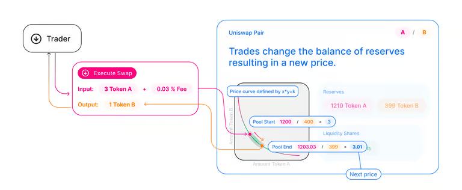
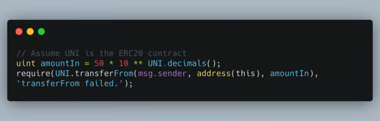
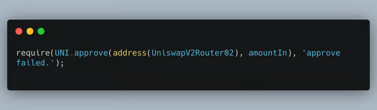
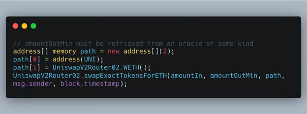

# Token Swaps

Token swaps are integral to the Uniswap interface and its backbone smart contract architecture. We demonstrated earlier how a user could use the Uniswap interface to swap two ERC-20 tokens. 

In short, swapping is very intuitive. The user picks the amount of the input token they have in reserve to exchange with the other token they want in their wallet. The protocol will do the rest, including calculating the price of asset X in the price of asset Y and swapping the assets upon the user’s signature. 

We learned earlier that the mechanisms that make this work are the Uniswap Pools and the AMM, which allows market-making in a fair way.  Use the graphic below to remind yourself how Uniswap functions in one figure. 



## One Function that Does it All: Swap

The developer that builds an interface or an application around Uniswap only needs to know how the Swap function is programmed. At first glance, this could look very simplistic, but there is much more to learn about how this function interacts differently than other contracts that interact with the token contract. 

```javascript
function swap(uint amount0Out, uint amount1Out, address to, bytes calldata data);
```

Receiving tokens could be easily understood from the function signature above. The function caller specifies the token they would like to receive through the amount10out as well as the address where the seller should receive the tokens. 

Sending tokens is quite complex and different from how this action is usually programmed with Solidity. Uniswap V2 first checks the token balances for the pair at the end of every transaction, and in the next transactions, the difference between the current balances of the pair and the one before would determine the number of tokens that were sent by the current sender.  If you want to dive deeper into this, the Uniswap V2 whitepaper1 is a great read. 

## Implementation

If we implement a swap at the smart contract level, the best way to achieve this is by using the Uniswap Router2. In the smart contract, there are multiple methods that will allow the developer to swap assets to/from an exact amount of ETH. 

When trading from a smart contract, it is important to ensure the price we are using is the same as the price of the token. As we discussed before, if the price we are using does not represent reality, it creates an arbitrage opportunity that can pose a significant threat. Therefore, using an oracle is a fairly important security measure.

Oracles provide a way for blockchains to access existing data sources outside of blockchain ecosystems. 

Since the router function’s infrastructure to implement a swap is available, it is quite easy to implement a swap.

Let’s assume we are looking to swap 50 UNI with the designated number of ETH. Then, the swap could be done with a couple of lines of code.



Firstly, we will calculate the number of UNI we would like to swap. Just like ETH, the unit measure of UNI is also different. We could find the right amount to transfer by calling UNI.decimals() and multiplying that with the target amount of 50.  

Then, we will have to transfer these tokens from the sender, namely msg.sender, to the contract, which is handled by address(this). The number of tokens to be transferred is the amountIn. We need a protection plan if the sender doesn’t have that many tokens or somehow fails to send us this on the blockchain. Therefore, we use the require() call to ensure that we have the plan to show an error if this fails. 



Our contract now owns 50 UNI. We must ensure that the UniswapV2Router02 can approve withdrawing this much of that UNI. If this fails, we should emit that the approval process has failed. If that goes well, we are ready to swap! 

The code below creates a list of two items of address type. Then, we get the address of the UNI and that of the WETH. Finally, we call the UniswapV2Router02 contract to finish this with parameters token amounts to be swapped, ERC20 addresses, the account that started the swap (who should also receive the equivalent ETH back), and the block time. 

