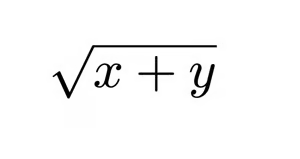
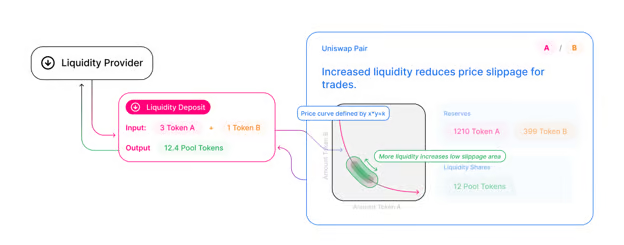

# Uniswap Pools

Every Uniswap pool is a liquidity pool between two pairs of ERC20 tokens. When a new token is deployed on Ethereum mainnet, there is no existing liquidity pool that allows traders to trade tokens with others. The main reason is that there has never been a liquidity provider (LP) for that token. The first LP needs to create the pool itself and be the first one in the pool to provide liquidity.

In Uniswap V2, a liquidity provider needs to call the Factory Contract1 to create a liquidity pool for the pair of tokens they would like to provide liquidity for. The Factory Contract is the Pair Contract2 that acts as the liquidity pool, also known as the liquidity pair, which allows trading between two tokens on the Ethereum blockchain. 

An important point here is that an LP could try to provide liquidity higher than what the market prices the assets at. However, as we discussed in ‘Introducing Uniswap’, pricing these assets higher/lower than the market price would create an arbitrage opportunity. Since the LP would find that undesirable, game theory works out perfectly by incentivising the LP to provide liquidity at the right price. 

## Liquidity Tokens

When an LP decides to provide liquidity for two tokens, Uniswap mints ERC20 tokens for the LP, what they also called liquidity tokens. In Uniswap V2, these tokens represent the LP’s contribution to the pool. If the LP is providing liquidity for that pool, say x for the first token and y for the second token, then the number of tokens the LP would receive would be equal to the following formula:



Providing liquidity is incentivised by the collection of fees that can later be claimed by the LP. If a trade occurs on the liquidity pool that the LP has provided liquidity for, 0.3% of that transaction amount is charged to the transaction sender. This fee is then distributed pro-rata to the LPs.



## Using the Router: Adding Liquidity

The best way to add liquidity for a pool is through using the Router Contract3. If the LP wants to provide liquidity for an ERC20 pair, then the LP could use the addLiquidity function to handle this on-chain. Below is the interface for the addLiquidity function with the required parameters to add liquidity:

```javascript
function addLiquidity(
    address tokenA,
    address tokenB,
    uint amountADesired,
    uint amountBDesired,
    uint amountAMin,
    uint amountBMin,
    address to,
    uint deadline
) external returns (uint amountA, uint amountB, uint liquidity)
```

Considering this function, it is fair to assume that if the centralised exchange gives 200 UNI for 1 ETH, the LP providers should provide the same amount for variables amountADesired and amountBDesired. It is, however, a possibility that the price provided above could be wrong by the time the transaction is accepted. Therefore, it is usually important to have a 1% tolerance level. 

For instance, if the LP wants to provide 200 UNI and 1 ETH, it is safe to provide 198 UNI and 0.99 ETH with the 1% tolerance in mind. This ensures that if a big price change happens, the liquidity will be added at 198 and 202 UNI / ETH ratio, ensuring the safety of the capital for the LP. 