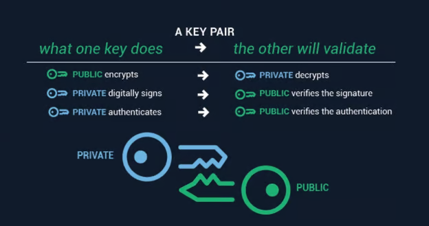
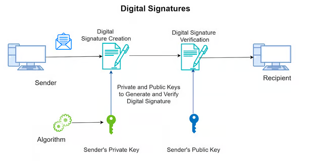
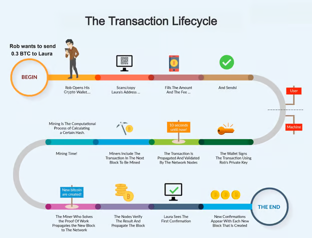

# Ethereum Transactions and Signatures, Private/Public-Keys

Firstly, we will need to understand the concept of authentication and account access. These are done with the help of a cryptographic key pair: a public key and a private key. A public key is a derivative of the private key. A private key is unique in nature. Let’s take the example of email. 

For receiving an email, you only need to share your email id. This information can be made public and is required to receive an email. But when you need to send one you need to log in to your email account using a password that is kept a secret with you. You must secure this password to prevent unauthorised access to your account.

In the same way, the public key can be thought of as your email id and the private key as your password. While the public key is broadcasted to the Blockchain network, the private key remains secret with the owner and must not be shared with anyone. 

A private key is used to sign the transactions sent by the user and can be verified only by the sender’s public key. This provides security and integrity to the network. 

A public key is a derivative of a private key. A private key can generate multiple public keys, so it is a one-to-many relationship. The ethereum address/metamask wallet address is a part of this public key. The address is the last 20 bytes of the hash of the public key.

The generation of these keys uses asymmetric cryptography, which means it is a one-way algorithm. The  public key can be derived from the private key, but the reverse is impossible. This keeps the private key a secret unless shared by the user. 

For achieving this level of security, powerful algorithms such as Rivest-Shamir-Adelman (RSA), Digital Signature Standard (DSS), Elliptic curve cryptography (ECC) are used.

Next, let’s talk about these signatures that are generated by the private key.

## Cryptographic Signatures
A signature is created using the private key of the sender. Whenever the user sends a message or transaction over blockchain, she has to sign that object with her private key, which uses Elliptic Curve Digital Signature Algorithm (ECDSA) to create that signature.

This involves encrypting the hash of the message or tx object and the sender’s private key.

A cryptographic signature contains three components, v, r and s, which are used for public key recovery. We don’t need to learn much about all this right now but they will be covered later in our advanced modules.

For a simple understanding, signatures are the validation that a particular transaction or message is sent by a particular account, just like we manually sign the documents that need  to be verified.  

Let’s understand this with an example. Bob wants to send Alice a message. He will first generate a hash of the message object and then encrypt the hash with his private key*. 

When Alice receives the message, she will first decrypt the message with Bob’s public key and then herself creates a hash of the message to match it with the hash sent by Bob. 

This validates that the message has been sent by Bob without being tampered with. 

However, if Bob wants just Alice to be able to decrypt the message, he will further encrypt the message with Alice’s public key. Now since this message can be decrypted using Alice’s private key only, no one else can tamper with it. So at the receiver’s end, Alice will first decrypt it with her private key, then with Bob’s public key and then will match the hash sent by Bob with the one she generated herself.

This way digital signatures/cryptographic signatures play a major role in verifying the sender of the transaction object in blockchain. 

## Blockchain transactions
Blockchain transactions (tx) are not just the transferring of crypto assets from one account to another. They include all the functions that change the state of the Blockchain. There are different types of transactions that we will later study. 

Transactions are the smallest unit of the Blockchain network. We have already created a few transactions using our wallet in previous modules. Now we will learn how these transactions are processed and added to the Blockchain. 

But before that, let’s look into the structure of a transaction.

## Structure of a Transaction 

- **Transaction Hash/Id:** Hash values generated by putting all the contents of the transaction in the hashing algorithm, for example, SHA256, Keccak256, .etc. 

- **Timestamp:** The exact time at which the transaction was created. This field also mentions the time at which the transaction gets executed. 

- **From:** Public key of the sender (initiator of the tx). 

- **To:** Public key(s) of the recipient(s).

- **Value:** Amount intended to be transferred from the sender’s wallet to the receiver’s wallet. 

- ***Hash:** A hash is a fixed length output generated by a cryptography algorithm operated over any variable length input.

- **Fees:** Transaction Fee is a small amount of crypto that the sender needs to send with the transaction. This increases the probability of the transaction to be included in the next block. Greater the fee, greater are the chances of the tx to get picked by a validator (Ethereum) or miner (Bitcoin). 

Transaction fees on Ethereum are called **Gas.**

- **Block Number:** The number/height of the Block the tx is included in. Every block in a blockchain has an id number that defines its queue number in the ledger. 

- **Status:** The status of the transaction, i.e., pending, success or failed. 

- **Tx Nonce:** This is actually the sender’s wallet transaction count, i.e., number of transactions conducted with that wallet +1. 

- **Input Data(Optional):** Any optional message sender needs to be included in the transaction. This message is encrypted and can only be decrypted with the recipient’s private key. It is mostly confidential. 

## Lifecycle of a Transaction

As shown in the illustration above of a Bitcoin transaction, the sender first fills out the required fields(amount, fee, recipient’s public key) and creates the transaction through his wallet. After the Tx creation, the sender signs the transaction with his private key, and the wallet application includes this signature in the transaction for verification. 

Once the transaction is sent from the sender’s wallet, it gets stored in the memory pool*(pending state). Bitcoin miners compete to create the next block, and the successful miner picks up the transaction and includes it in a block*. Mining is the process of adding the next block to the Blockchain.

After mining the block, it is broadcasted over the network. Other miners receive this block and validate it as well as the transactions included in the block by validating the signature using the public key of the sender of a particular transaction.

If the block is valid, the peers add it to their blockchain and the transactions of that block get executed and removed from the memory pool. In case the block gets rejected, all the transactions fail and are sent back to the memory pool.

*A memory pool is a ledger that contains all the transactions that have not been added to any block yet.