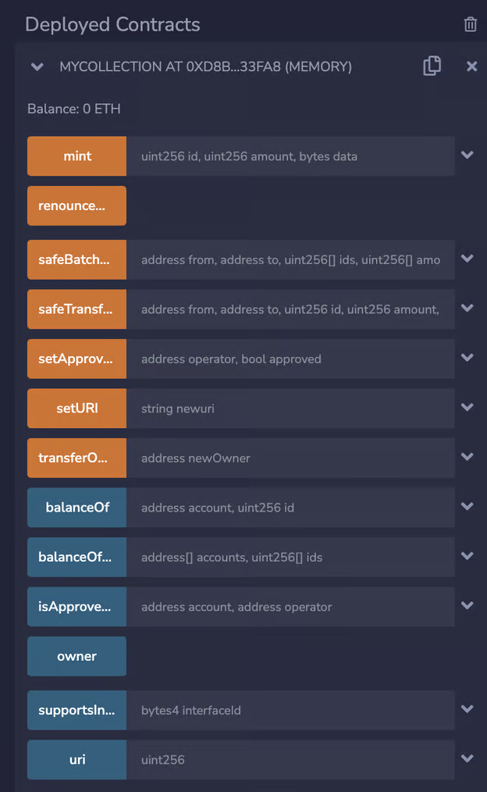

# ERC-1155 – Semi-Fungible Tokens

ERC-1155 is the standard that’s used to create tokens of different kinds (each kind represented by a token ID). However, in contrast to ERC-721, each kind or token ID can have multiple copies.

Thus the tokens of a particular token ID are fungible, but those of different token IDs are non-fungible.

It can be visualised as depicted below:

- ID 0 : 2000 tokens
- ID 1 : 13000 tokens
- ID 2 : 500 tokens

and so on. 

Just like ERC-20 and ERC-721, the ERC-1155 standard also requires certain functions to be a part of the smart contract to ensure the predictability of the behaviour of the contract.

These standard functions are listed below:

- **balanceOf:** Returns the amount of tokens of a particular ID owned by a certain address. Takes the user address and token ID as parameters.
- **setApprovalForAll:** Allows an address A to enable another address B to transfer any token that the address A holds. The same function is used to undo it. Takes the address to be approved (operator) and a bool value of true/false as parameters.
- **isApprovedForAll:** A function that returns if the `operator` is allowed to manage all of the assets of `owner`. Takes the owner’s address and the operator’s address as parameters.
- **safeTransferFrom:** A function that transfers token(s) of a particular ID from its owner’s address to another address. Takes owner’s address, receiver’s address, token ID and amount of tokens as parameters.

Let’s create a smart contract to create an ERC-1155 collection. We’ll import Open Zeppelin’s code for standard functions and add our functionality on top of it:

```solidity
    // SPDX-License-Identifier: MIT
    pragma solidity 0.8.7;
    
    import "@openzeppelin/contracts/token/ERC1155/ERC1155.sol";
    import "@openzeppelin/contracts/access/Ownable.sol";
    
    contract MyCollection is ERC1155, Ownable {
        constructor() ERC1155("") {}
        
        function setURI(string memory newuri) public onlyOwner {
            _setURI(newuri);
        }
    }
```

The above code imports OpenZeppelin’s contract for ERC-1155 and creates a collection called MyCollection.

It also has a function `setURI` to set the contract URI that contains the information and details about the token collection.
But currently, there’s no token minted. We’ll add a function that enables a user to call the _mint function in the imported OpenZeppelin code as depicted below:

```solidity
    // SPDX-License-Identifier: MIT
    pragma solidity 0.8.7;
    
    import "@openzeppelin/contracts/token/ERC1155/ERC1155.sol";
    import "@openzeppelin/contracts/access/Ownable.sol";
    
    contract MyCollection is ERC1155, Ownable {
        constructor() ERC1155("") {}
        
        function setURI(string memory newuri) public onlyOwner {
            _setURI(newuri);
        }
        
        function mint(uint256 id, uint256 amount, bytes memory data)
            public
        {
            _mint(msg.sender, id, amount, data);
        }
    }
```

`_mint` is an internal function defined in the OpenZeppelin code. We call it by defining our own function mint so that we can add any other conditions to it just like we did for ERC-721. Again, we’ll use these conditions in future modules when we create more complex contracts.

Now, when we deploy this contract, it provides us the functionality to mint the tokens and use all the other functionalities provided by the ERC-1155 standard that we discussed above.

