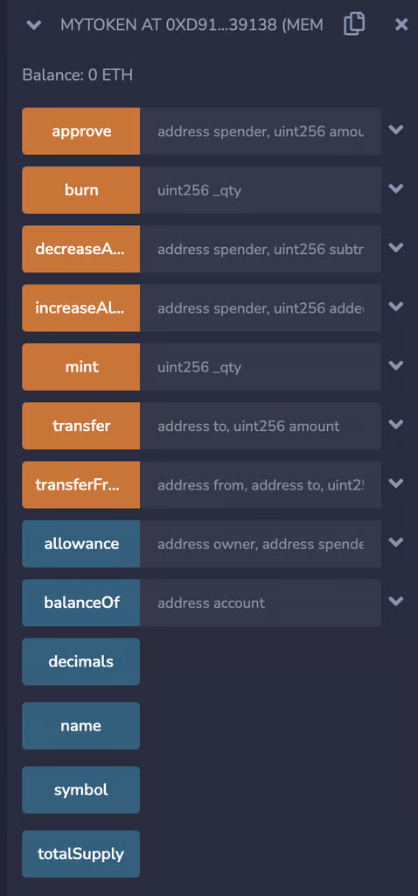

# ERC-20 – Fungible Tokens

## Intro to ERC-20, ERC-721 and ERC-1155

On blockchain, we can create virtual assets. These assets can be categorised into mainly 3 types based on their fungibility. In order to standardise the behaviour of these assets, we need to follow an ERC standard while creating them.

In the previous lesson, we briefly touched on what these different standards mean. Now, let’s try to understand these popular crypto-token standards with an example of different ticketing systems:

**CASE 1:** When you ride a metro/subway train, the ticket you buy is the same as everyone else for the same destination. Even if you exchange the ticket with someone, it would still work for you as there’s no differentiator between those tickets. Such items are called ‘fungible’, meaning that they can be mutually exchanged. Other examples of fungible items are currency notes, shares of a company etc.

**CASE 2:** When you take a flight, you can’t exchange your boarding pass with another person even if you both are going to the same destination. That’s because your boarding pass has your name and your seat number, both of which are unique. Hence each boarding pass is different from others. Such items are called ‘non-fungible’, meaning they can’t be exchanged with other items. Other examples of non-fungible items are your driving licence, your college degree, a piece of art etc.

**CASE 3:** When you attend a concert, you can buy a General pass, VIP pass, Multi-day pass and so on. If you hold a general pass, you can exchange your pass with someone holding a general pass but not with someone holding a VIP pass. Hence, such items are a mixture of fungible and non-fungible. Different categories of passes are non-fungible, but the passes within the same category are fungible. Other examples being shares of different companies, metro tickets for different destinations etc.

On the blockchain, we can represent digital assets and real-world assets with the help of ‘tokens’. Usually, these tokens are created following a standard so that they can have predictable behaviour, properties and security.

Tokens representing assets like Case-1 are called ERC-20 standard tokens. Like USDC, wrapped ether etc.

Tokens representing assets like Case-2 are called ERC-721 standard tokens. Like BAYC NFTs, Cryptopunks NFTs, house deeds, marriage registrations etc.

And finally, tokens representing assets like Case-3 are called ERC-1155 standard tokens. Like fractionalised music video NFTs, fractionalised real estate etc.

## ERC-20

The ERC-20 token standard describes the basic functionality of fungible tokens. Every ERC-20 token can be exchanged with every other ERC-20 token for the same value provided they belong to the same smart contract. 

In this lesson, we will create our own ERC-20 token. 

For this, we will be using the **ERC20.sol** provided by OpenZeppelin Library. This smart contract will be used to mint (create), burn (destroy), and transfer the tokens. In ERC20.sol, some functions are internal (not accessible outside the contract) and need to be called within some external functions of our smart contract.

There are some other functions as well:

- **approve:** Allows the caller to approve another account to spend some tokens from his account.
- **decreaseAllowance:** Allows the caller to decrease the approved amount of tokens to spend for an approved spender.
- **increaseAllowance:** Allows the caller to increase the approved amount of tokens to spend for an approved spender.
- **transferFrom:** Allows an approved spender to spend tokens from the account he is allowed to spend from.
- **allowance:** Returns the amount of tokens that a spender is approved of spending from the owner’s account.
- **balanceOf:** Returns the token balance of a particular account.
- **decimals:** Returns the number of  decimals used to represent the token balance of a user. For example, if decimals returns 3 and the balance of a user is 20, it will be represented as 20.000.

So let’s start with creating a basic smart contract and importing ERC20.sol.

```solidity
    //SPDX-License-Identifier: MIT
    pragma solidity 0.8.7;
    
    import "@openzeppelin/contracts/token/ERC20/ERC20.sol";
    
    contract MyToken is ERC20 {
    
    }
```

ERC20.sol takes two parameters in its constructor, the token name and token symbol. To inherit it properly, we need to implement its constructor. Let’s call this token Cookie and symbol “CKE”.

```solidity
    contract MyToken is ERC20 {
        constructor() ERC20("Cookie", "CKE") {
            _mint(msg.sender, 10000 * 10 ** decimals());
        }
    }
```

This small code creates our Cookie token with a supply of 10000 minted to the msg.sender. However, we can’t mint any more tokens later with this code. For that, we’ll need to add a function for minting additional tokens. Let’s now create a public function to call the internal _mint function of ERC20.sol.

```solidity
    function mint(uint _qty) public {
        _mint(msg.sender, _qty);
    }
```

This function will create _qty amount of cookie tokens within the account of the function caller and increase the totalSupply by _qty.

Similarly, we’ll create a function for burning the tokens.

```solidity
    function burn(uint _qty) public {
        _burn(msg.sender, _qty);
    }
```

This function will destroy _qty amount of tokens within the account of the function caller and decrease the totalSupply by _qty.

For transferring the tokens from sender’s account to receiver’s account, we can use the transfer function already implemented in ERC20.sol as it is public.

Let’s compile and deploy this contract.

```solidity
    //SPDX-License-Identifier: MIT
    pragma solidity 0.8.7;
    
    import "@openzeppelin/contracts/token/ERC20/ERC20.sol";
    
    contract MyToken is ERC20 {
        constructor() ERC20("Cookie", "CKE") {
            _mint(msg.sender, 10000 * 10 ** decimals());
        }
    
        function mint(uint _qty) public {
            _mint(msg.sender, _qty);
        }
    
        function burn(uint _qty) public {
            _burn(msg.sender, _qty);
        }
    
    }
```



After deployment, all the functions as shown in the above image are visible. Please try out minting and burning the tokens and observe the change in totalSupply. You can also try transfering the tokens from one account to another, this will not affect totalSupply. 