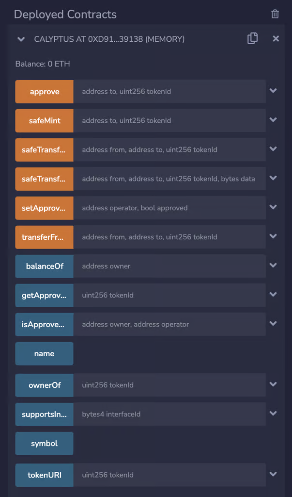

# ERC-721 – Non-Fungible Tokens

ERC-721 is a standard to create tokens that represent something unique and thus can’t be exchanged with each other. For example, digital collectibles, certifications, legal documents etc.

These tokens are called Non Fungible Tokens or NFTs.

Just like ERC-20, the ERC-721 standard also requires certain functions to be a part of the smart contract to ensure the predictability of the behaviour of the contract.

These standard functions are listed below:

- **balanceOf:** Returns the number of NFTs owned by a user
- **ownerOf:** A function that returns the address of the owner who holds a particular NFT (denoted by its ID). Takes token’s ID as a parameter.
- **safeTransferFrom:** A function that transfers a particular NFT from its owner’s address to another address. Takes owner’s address, receiver’s address and token ID as parameters.
- **approve:** A function that enables an NFT’s owner to approve another address to transfer that NFT on his/her behalf. Takes the address to be approved and token ID as parameters.
- **setApprovalForAll:** A function that allows an address A to enable another address B to transfer any NFT that the address A holds. The same function is used to undo it. Takes the address to be approved (operator) and a bool value of true/false as parameters.
- **getApproved:** A function that returns the account approved for a particular token. Takes token ID as a parameter.
- **isApprovedForAll:** A function that returns if the `operator` is allowed to manage all of the assets of `owner`. Takes the owner’s address and the operator’s address as parameters.

Let’s create an NFT contract in order to generate an NFT collection called Calyptus. We’ll import the above Open Zeppelin code for standard functions and add our functionality on top of it.

```solidity
    // SPDX-License-Identifier: MIT
    pragma solidity 0.8.7;
    
    import "@openzeppelin/contracts/token/ERC721/ERC721.sol";
    
    contract Calyptus is ERC721 {
        constructor() ERC721("Calyptus", "CAL") {}
    }
```

The above code imports OpenZeppelin’s contract for ERC-721 and creates a collection called Calyptus with a symbol CAL.

But currently, no NFT has been minted (created). We’ll add a function that enables a user to call the _safeMint function in the imported Open Zeppelin’s code as depicted below:

```solidity
    // SPDX-License-Identifier: MIT
    pragma solidity 0.8.7;
    
    import "@openzeppelin/contracts/token/ERC721/ERC721.sol";
    
    contract Calyptus is ERC721 {
        constructor() ERC721("Calyptus", "CAL") {}
    
        function safeMint(address to, uint256 tokenId) public {
            _safeMint(to, tokenId);
        }
    }
```

`_safeMint` is an internal function defined in Open Zeppelin’s code. We call it by defining our own function safeMint so that we can add any other conditions to it. For example, we can require the address to be whitelisted, or have a certain balance, or check if the current supply is less than the max supply etc. before a user is allowed to mint it. We’ll use these conditions in future modules when we create more complex contracts.

Now, when we deploy this contract, it provides us the functionality to mint an NFT and use all the other functionalities provided by the ERC-721 standard that we discussed above. For example: safeTransferFrom, approve etc.

Note that currently we’ve written a contract to mint token IDs to addresses. But there’s no images or data attached to it. That’s because these images and data are quite large to be stored on the blockchain. In our module on the NFT project, we’ll learn how to upload our images and metadata on a platform called IPFS and connect it to our smart contract.

