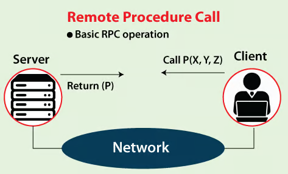
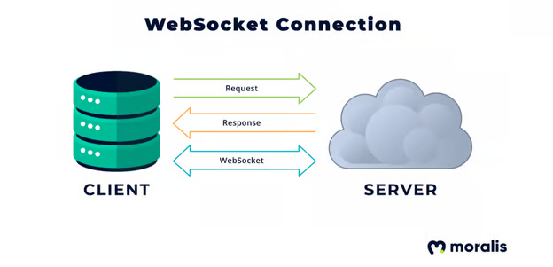

# RPC, IPC & WebSocket

To access the data stored on a Blockchain or to interact with it, we need to establish a connection between our system and the Blockchain. So far we have used tools like Metamask, Infura, Ethers js and Geth to establish this connection and interact with smart contracts or in general with the Blockchain network.

In this lesson, we will understand the types of connections that these tools use themselves. There are typically three types of node connections that can be established with a Blockchain Network:

- RPC (Remote Procedure Call), can be established using Metamask, Infura, Geth and other node providing services.
- IPC (Inter-Process Communications), can be established using Geth, Ethers js, Web3 js.
- WebSocket, can be established using Infura and other node providing services.

Let’s understand each of these one by one.

## RPC (Remote Procedure Call)

RPC stands for remote procedure call and is a form of inter-process communication (IPC). In distributed computing, RPC refers to the process in which a program executes a subroutine in a discrete location. These locations are also commonly referred to as the address space.

When an RPC is performed, a request response process occurs between the different address spaces. One address calls the procedure while the other responds, and these two are often referred to as “client” and “server”. This means that the client sends a request to execute a procedure with the specified parameters to a remote server. In return, a response is sent back from the server to the client.

All RPCs are coded on the same basis as regular programming or function calls. This means that developers use the same code whether the subroutine is for local or remote execution. Therefore, the programmer does not need to specify where the procedure will run.

RPCs are useful because they allow developers to split apps and dApps into different pieces. These sections can work independently of each other, which means we can separate the logic from the presentation. Therefore, it is possible to separate the user interface from the actual application when it comes to web applications. One of the benefits is that it can improve security because the data itself can only be accessed by calling functions.

One disadvantage of using public RPC nodes is that they are heavily crowded and oftentimes fail to fetch information that results in a Timeout condition. Instead, developers tend to use node prodigy services such as Infura, Alchemy or Moralis.

## IPC (Inter-Process Communication)

Inter-process communication (IPC) is a set of techniques for exchanging data between multiple threads in one or more processes. Processes can run on one or more computers connected to the network.

IPC usually works locally on the systems. While establishing a connection between Ethereum Blockchain and our local computer, we use Geth that creates an IPC pipe. This is represented by the file geth.ipc, which we used in the previous module, “Running a Node with Geth”.

## WebSocket

WebSocket is a TCP-based bidirectional communication protocol that standardises client-server communication, allowing both parties to request data from each other. In contrast, a one-way protocol like HTTP only allows the client to request data from the server.

The WebSocket connection between the client and the server can remain open as long as the parties want it to remain connected, allowing communication to continue.

With HTTP, each connection begins when the client makes a request and ends when the request is satisfied.

WebSockets can be superior for Web3 dApp notifications because they allow real-time notifications for persistent critical events versus individual requests.

WebSocket connections can be established using Infura, Alchemy or other node providers.